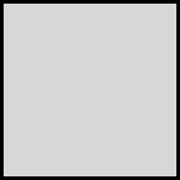
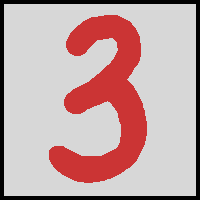
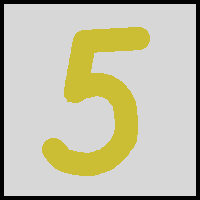
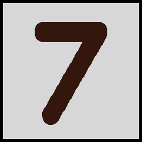
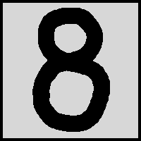
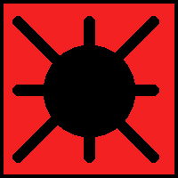
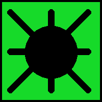

# Mines
My mines game on C++ SDL2.

# GamePlay

https://user-images.githubusercontent.com/69923041/158681139-e1550ebe-f78e-4267-8b1f-03718a32c36e.mp4

# Controlls
<ul>
    <li>r - reset map</li>
    <li>1 - 8x8, 10 bombs</li>
    <li>2 - 8x8, 20 bombs</li>
    <li>3 - 16x16, 30 bombs</li>
    <li>4 - 16x16, 50 bombs</li>
    <li>5 - 24x16, 50 bombs</li>
    <li>6 - 24x16, 70 bombs</li>
    <li>7 - 32x16, 70 bombs</li>
    <li>8 - 32x16, 100 bombs</li>
    <li>9 - 32x16, 200 bombs</li>
    <li>LMB - open field</li>
    <li>RMB - set flag</li>
</ul>

# Textures

    Standart closed field

    Opened empty field

    Opened field of 1 bomb around

    Opened field of 2 bombs around

    Opened field of 3 bombs around

    Opened field of 4 bombs around

    Opened field of 5 bombs around

    Opened field of 6 bombs around

    Opened field of 7 bombs around

    Opened field of 8 bombs around

    Opened bomb field in lose

    Opened bomb field in win

    Closed field with flag

